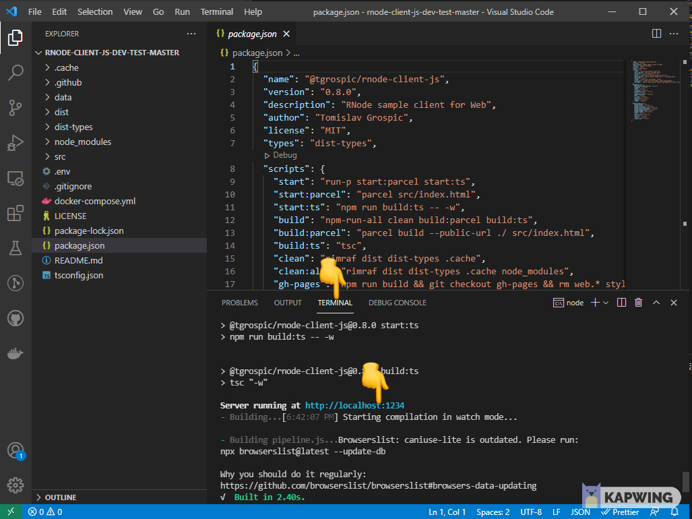
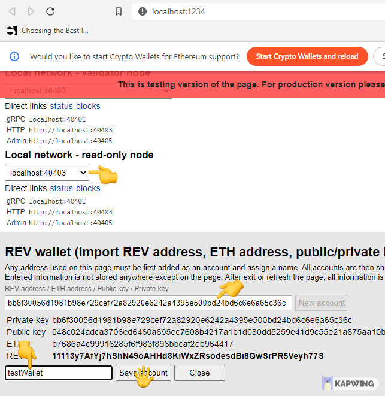
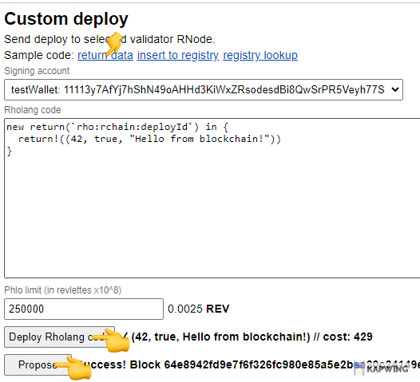

# Setup local rnode instance

This document describes how to setup a docker rnode instance on your local computer. This is for testing purposes, so you can test your code in a local test environement. Your code will behave, like it will on the real network.

## Installing rnode (docker)

The rnode docker instance is running on Windows, Linux, Mac. This tutorial describes the installing process for windows, but other operating systems are similar to setup.

**Prerequisites:**
Windows 10, Linux, Mac

1. Install the latest updates for windows 10 and install the latest version of [docker](https://hub.docker.com/editions/community/docker-ce-desktop-windows/). Click on **Get Docker** and install it on your pc. Restart the pc.
2. There has to be a **white** docker logo on the windows taskbar.
   If the docker logo ist red, then there is a docker problem with your pc (sometimes wsl_update_x64.msi has to be additionally installed).
   

3. Download the [rnode-client-js-dev-test](https://github.com/tgrospic/rnode-client-js-dev-test) ➜ For that go into vscode and there click on View ➜ Command Palette
   
4. Then type in: git clone.  
   

   If there is not git clone to select, you have to install [Git SCM](https://git-scm.com/downloads) on your pc .
   Click on git clone and type in:

   ```javascript
   https://github.com/tgrospic/rnode-client-js-dev-test.git
   ```

     
   Select the folder you want to download the files. After it has downloaded the repo, click on the button **Open** on the right bottom in vscode.

5. Open a terminal in vscode (Terminal ➜ New Terminal). Then open a Command Prompt (not powershell)
   

   Type into the command promt:

```javascript
   $ docker-compose up -d
```

> ⚠️ If you get errors in your console, then check that docker is not in an error state.

6. Open the docker setting if you want to see the logs of rnode (small icon on the taskbar)
   

> ⚠️ If you get the following errors in your console:  
> **Error: bind: An attempt was made to access a socket in a way forbidden by its access permissions.**  
> **Solution**: this is due to hyper-v binding the ports. Open cmd and type:
>
> ```javascript
> $ netsh interface ipv4 show excludedportrange protocol=tcp
> $ net stop winnat
> $ netsh int ipv4 add excludedportrange protocol=tcp startport=50400 numberofports=10
> $ netsh int ipv4 add excludedportrange protocol=tcp startport=60400 numberofports=10
> $ net start winnat
> ```
>
> **Error: Windows push notification framework is missing**  
> **Solution**: enable windows push noftification (WpnService) or disable this in WPD (windows privacy dashboard)
>
> **Error: binding error**  
> **Solution**: if you have installed the rholang extension for vscode, disable under extension settings: Run Rnode with Docker.

## Deploy to the local rnode instance

1. Open vscode and open the downloaded folder: [rnode-client-js-dev-test](https://github.com/tgrospic/rnode-client-js-dev-test)

2. Open this folder inside vscode and open a terminal:

```javascript
   $ npm install
```

3. After installing the packages then type:

```javascript
   $ npm run start
```

> ⚠️ If you get the errors in your console, then you have to go to **File ➜ Open Folder** and go one folder deeper.



4. Open the http://localhost:1234 link in the browser
5. Select localhost and type in the following private key

```bash
bb6f30056d1981b98e729cef72a82920e6242a4395e500bd24bd6c6e6a65c36c
```



6. Name the wallet and save it.

> ⚠️ Never type a private key in an app your don't trust, this is only a private key for testrevs, so no real mainnet tokens.

7. Click on an example contract (here return data) click on **Deploy Rholang code** and then click on **Propose**. After a very seconds there should be a return value.
   
