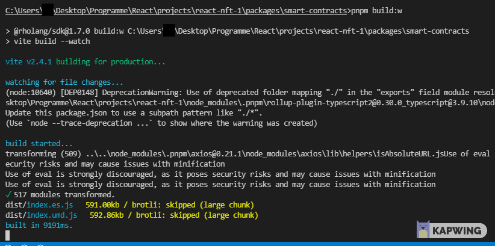
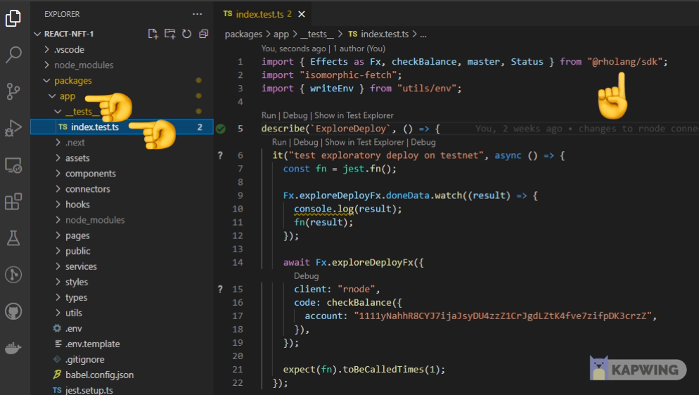
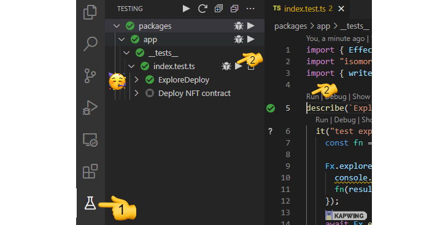
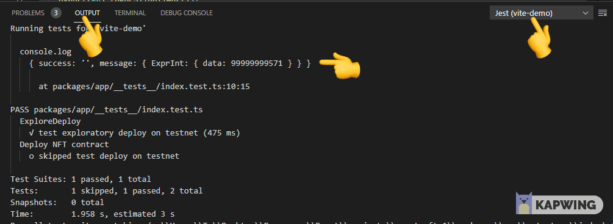

# Rholang SDK usage

This chapter describes how you can use the rholang-sdk as a template for your web dApp. It includes:

- Rholang bundler (rholang to js/ts bundler)
- A testing framework based on jest for evaluating your deploys.
- All need libraries for interacting with the rchain network (locally/testnet/mainnet) are included.
- A frontend app, which is a nft template web application written in typescript and executed on vercel.com (static site).
- Interaction with the metamask plugin and the nft template web app.
- Cloudflare workers for caching rholang exploratory deploys from the rchain network.

## Installing the SDK

The SDK works with Windows, Linux, Mac. This tutorial describes the setup process for windows.

**Prerequisites:**
Windows 10, Linux, Mac

**Optional, but recommended:**  
Local rnode (docker) instance. Look [here](/dapps/setup-docker/), how to do it.

1. Download the dApp template from here: [nft-template](https://github.com/rholang/nft), extract it and open it in vscode.
2. Open a terminal and install **pnpm** globally (like yarn, but faster, better workspaces support)

```javascript
  $ npm install -g pnpm
```

> ⚠️ If you get the following errors in your console:  
> **Error**: cannot be loaded because running scripts is disabled on this system.  
> **Solution**: use in vscode the command prompt instead of powershell.


3. After that, type into the vscode terminal:

```javascript
  $ pnpm install
```

7. After all project dependencies are installed, go under packages/smart-contracts/src/rholang. Here are the rholang smart contract files stored. You can write additional rholang code at this place.  
   If you want to insert a external javascript variable, then type "rho:arg:&lt;variable name&gt;". E.g "rho:arg:account" .
   This contract can then later be called with checkBalance({account:"0x1223232"}).


8. Bundle your .rho files into javascript/typescript files. Type into the console:

```javascript
  $ pnpm build:w
```


This will build the @rholang/sdk package with watch-mode. It is also generating type informations for importing this into your frontend app. If you change your .rho file and save it, then it will automatically generate a new js/ts output in the dist folder.

## Testing rholang code

1. Start up your local rnode (docker) instance. [Setup local rnode (docker)](/dapps/setup-docker/)
2. Install the following vscode extensions: **Rholang, Jest, Test Explorer UI, Jest Test Explorer, Vite**.
3. Go to the test file (here index.test.ts in the packages/app/\_\_tests\_\_ folder).  
   The generated rholang files can be imported with import {...} from "@rholang/sdk"
   

4. If you have the vscode extensions installed, you can see on the left sidebar a test logo (1). Click on it.  
   You can then click on the test case in the ui (2) or open the test file and click on Run



> ⚠️ If you get the following problems:  
> **Error**: Test Explorer UI extension is not showing any tests and run/debug is not available if you open index.test.ts.  
> **Solution**: restart vscode. If there is on the right bottom a notification with: "This workspace contains a Typescript version ..." then click on the **Allow** button.

4. Open the vscode terminal and go to jest (vite-demo) output. You can see the result of the exploratory-deploy or deploy of the rholang code from the local rnode instance.
   

## Executing the NFT template app

1. in the vscode terminal type:

```javascript
 $ pnpm run dev
```

2. open the link to the localhost url in the browser.
