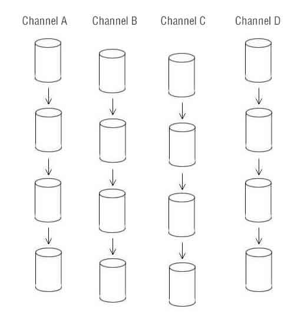
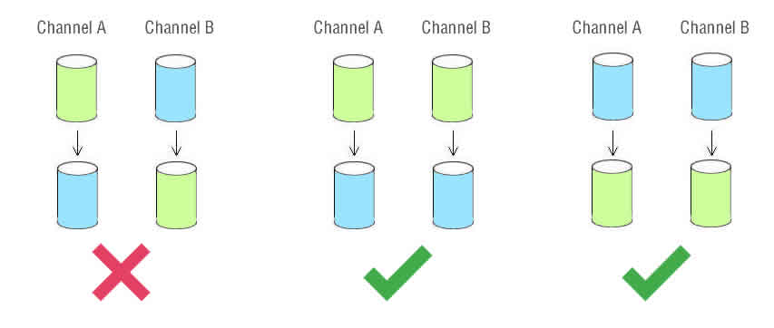
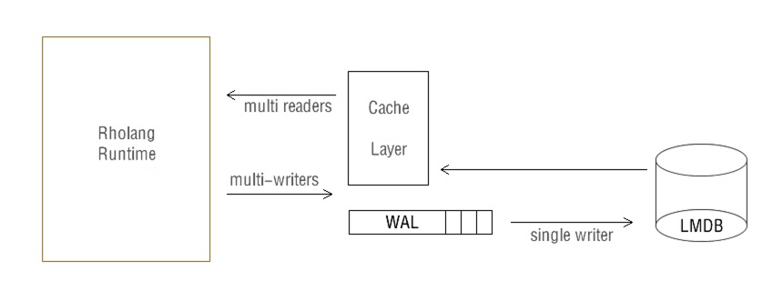

# A Lockless Tuplespace
As you may notice in the [performance comparison](https://github.com/wangjia184/rholang-rust/wiki/Performance-Benchmark-with-Scala-Edition,-70-times-faster!) between Scala edition and Rust edition, the latter outperforms ~30x in sequence execution, and when the rholang code can be executed concurrently or parallelly, it outperforms ~70x! That means the Rust edition scales much better. One of the secrets is its distinct lockless tuplespace.

# The Problem

The tuplespace can be simply seen as a big HashMap. Send (e.g. `name!(Q)`) produces a message to a channel(or name) while receive (e.g. `for( _ <- name )`) consumes one from certain channel. During rholang execution, data race could only happen between produces and consumes within tuplespace. RhoVM only needs to solve race condition in tuplespace and then rholang code can safely execute in parallel without synchronization primitives. That sounds simple but actually not easy.

Consider the following challenges in rholang.

1. **Pattern Matching**<br />
   Produce and consume can happen in any order, but that does not mean they can match arbitrarily. Pattern matching must be considered and sometimes they cannot pair with each other. <br />E.g. `x!("hello") | for ({"hello" | "world"} <- x){Nil}`

2. **Unpredictable**<br />
   It is impossible to know in advance which channel to produce or consume before evaluation. 
```
for(x <- @{a+b}) { 
    x!(Q)
}
```

3. **Join**<br />
   Receive could consume from multiple channels at the same time. <br />E.g. `for(_ <- a; _ <- b; _ <- c) | for(_ <- c; _ <- d; _ <- f)`. 

Produce and consumes can execute parallelly but synchronization cannot be avoided. The pattern matching/join makes the situation complication. To solve the problem, the Scala edition takes use of [locks](https://github.com/rchain/rchain/tree/dev/rspace/src/main/scala/coop/rchain/rspace/concurrent) heavily. That works but it does not scale well, especially lock contentions could eliminate virtually all of the performance benefit of parallelism.

**Can we have a tuplespace without lock but still work correctly?**


# The Solution

In the reason of pattern matching, channel(name) must be able to store dataums and continuations. In source code [Transit](https://github.com/wangjia184/rholang-rust/blob/0.0.1/rho_runtime/src/storage/transit.rs#L37-L44) struct is defined to represent the channel.

```rust
struct  Transit {
    dataums : ShortVector<Dataum>,
    consumers : ShortVector<IndependentConsumer>,
    persistented_consumers : ShortVector<IndependentConsumer>,
    joined_consumers : ShortVector<JoinedConsumer>,
}
```

The behaviour of send/receive tasks towards a channel can be explained as

* **Send** tries to match a consumer stored in `Transit`. If there is no match, the dataum is stored.
* **Receive** tries to match a dataum stored in `Transit`. If there is no match, the continuation and pattern are stored as consumer.

The task performing changes to `Transit` is located in critical section. -- Two tasks on the same `Transit` is disallowed at the same time. Without lock, the access to a single `Transit` must be chained. Whenever a task in tuplespace needs to perform operation to certain `Transit`, it first gets the `Transit` from previous task operating on this channel(name). Then perform changes to `Transit`. After the current task completes the operation, it passes the `Transit` to the next task channel(name).

Thus, [TransitPort](https://github.com/wangjia184/rholang-rust/blob/0.0.1/rho_runtime/src/storage/coordinator.rs#L67-L69) is defined as below.

```rust
struct TransitPort {
    completed_signal : Option<oneshot::Receiver<Transit>>,
}
```

[Oneshot](https://docs.rs/tokio/1.5.0/tokio/sync/oneshot/fn.channel.html) is a lightweight tunnel provided by tokio. 

Whenever a task intends to perform changes to a `Transit`, it replaces the `oneshot::Receiver<Transit>` with its own one. The current task starts changes after it receives `Transit` from previous task. And pass `Transit` to the next task after it completes.

```rust
        // get the transit port of this channel
        let transit_port = self.get_or_create_transit_port(channel);
        // create a pair of sender + receiver
        let (tx, rx) = oneshot::channel();
        
        // replace receiver which will be signaled when current coroutine completes
        let prev_signal = match transit_port.borrow_mut().completed_signal.replace(rx) {
            Some(signal) => {
                signal
            },
            None => {
                // no previous Receiver, this is a fresh new channel
                // create one
                let (prev_tx, prev_rx) = oneshot::channel();
                prev_tx.send(Transit::default());
                prev_rx
            }
        };
        // first get Transit from previous task
        let transit = match prev_signal.await;
        // now we can access transit
        // ...  send or receive
        // operation is completed, now pass Transit to next one
        tx.send(transit);
```

It can be seen as a pipeline. Each task hooks to the result of previous task on the same channel(name). The `Transit` is sent through the pipes and operations are performed.


The tuplespace is a HashMap whose value is the `TransitPort` of each channel(name). Whenever a task needs to access a channel(name), it looks up the `TransitPort` and access `Transit` in the approach described above.

```rust
transit_port_map : FxHashMap<Hash, Rc<RefCell<TransitPort>>>
```

The channels in tuplespace can be accessed in parallel without affecting each other.


**But what about joins?**
A task might access multiple channels together.  For example, 

```
for( _ <- a; _ <- b; _ <- c) { X } |
for( _ <- a; _ <- b; _ <- e) { Y }
```

When X and Y both consume `a` and `b`, if X acquires `a` and waiting for `b`, while Y acquires `b` and waiting for `a`, that is dead lock!

The key to avoid deadlock is to avoid recursive dependency. `Coordinator` accepts all the sends and receives, and arrange them to avoid recursive dependency.

The key to avoid deadlock is to avoid recursive dependency. 




[Coordinator](https://github.com/wangjia184/rholang-rust/blob/0.0.1/rho_runtime/src/storage/coordinator.rs#L163-L185) handles all the sends and receives, and arrange them to avoid recursive dependency.

```
fn run(&mut self) {
        loop {
            while let Some(pending_task) = self.share.queue.pop() {
                match  pending_task {
                    PendingTask::Install(install) => {
                        self.handle_install(install)
                    },
                    PendingTask::Produce(produce) => {
                        self.handle_produce(produce)
                    },
                    PendingTask::Consume(consume) => {
                        self.handle_consume(consume);
                    },
                    PendingTask::Join(join_task) => {
                        self.handle_join(join_task);
                    }
                    PendingTask::Uninstall => {
                        return;
                    }
                }
            }
            self.share.notify.notified().await;
        }
        
    }
```

The work done by `Coordinator` is very simple. First looks up all the `TransitPort` required by the send/receive, create new `Receiver` to them and attach the task to handle them. And spawn the async tasks to actually handle them. Because it is a lightweight coroutine, it will not be a bottleneck of the system.


Also the spawn tasks `await` on the receivers, and perform the actual job when all required `Transit`s are ready. And if synchronization is required, they are naturally piped and no data race, no locks, no cost.  And parallelism is still maximized.

More explaination:

The MPSC queue is only used by coordinator to accept (send/receive) commands from multiple-threaded reduction, Coordinator  does not wait for anything and commands wont be stocked in the queue.  Coordinator picks up the messages from the queue,  it does not care the current status of channels,  Coordinator  only hooks those tasks after the last pipe of the channel.  And the tasks are executed as coroutine, will be waken up when channels are ready.
> Suppose  channel `a` is being consumed by  `for( _ <- a; _ <- b)`    and `for( _ <- a; _ <- c)`.  so there are two joined consumers for channels `a+b` and channels `a+c`
When sending dataum to `a`,  Coordinator first hook a coroutine(`handle_produce`) only on `a`, and the coroutine will be executed when `a` is ready. 
When this coroutine executes, it only gains the access to channel `a`,  but that does not matter.
It first tries to match any independent consumer, if independent consumer matchs,  no need to continue.
>When it detects that no independent consumer can be matched it stores the dataum in channel.
Then it checks the joined consumers - if the dataum can be matched with `a` in `a+b` or `a+c`.
It does not care if `b` or `c` can be matched at this moment (actually it can't because it does not gain the access).
If dataum can be partially matched, let's say a+b's a,  it sends another join(a+b) command to coordinator.
And coordinator will spawn another coroutine(join(a+b)) to check if the dataum can be matched in a+b since the second corouting gain access to both channels; If still it cant be matched, and it found dataum can match a+c's a,  it sends another command to coordinator to spawn `join(a+c)`
>The idea is:  the consumers in a channel could be very complicated,  different patterns,  different channels.   We should not try to complete all the matching within a single coroutine execution since that would enlarge the critical section and gained channels more than we need.  We'd better distribute the matching job into different coroutines, and each of them only gains the access to minimal required channels. The coroutines are very lighweight so they run very fast. Still between their execution, there could be other coroutines hooked to these channels by coordinator. So the others still can access the channels and they can send/receive as usual. that ensures the system overall throughput.
# Looking Ahead

Even after persistent layer is added, this model still works well. We can decouple the IO from the execution part. We can have Write-Ahead-Log to write to LMDB without blocking the execution. We only need read once from LMDB for certain name into in-memory tuplespace.


